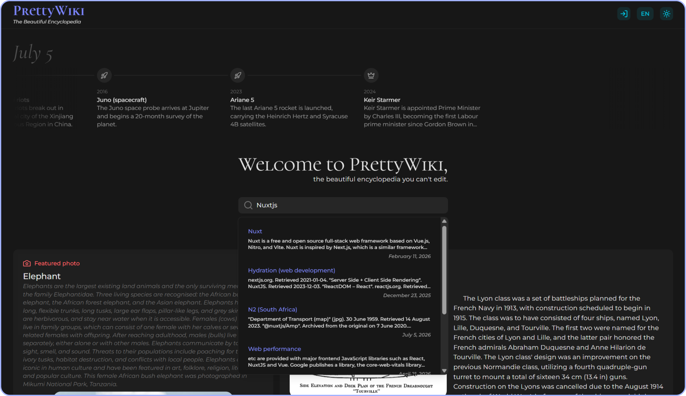
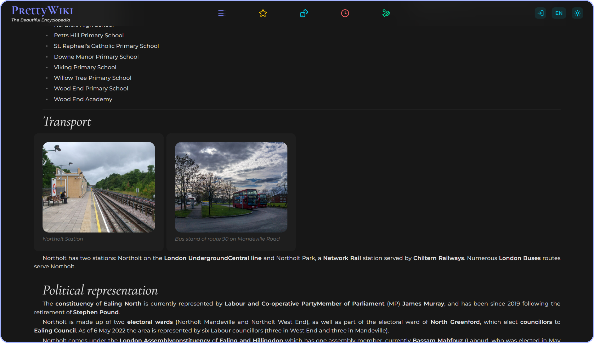
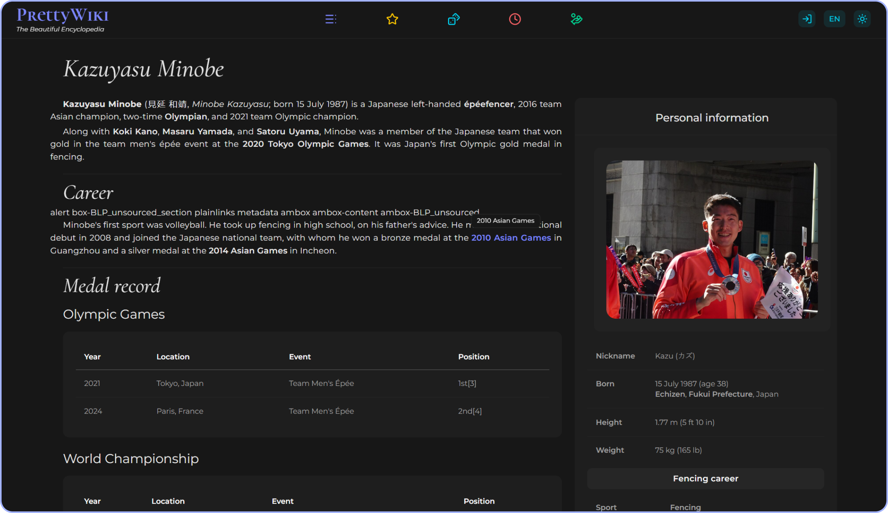
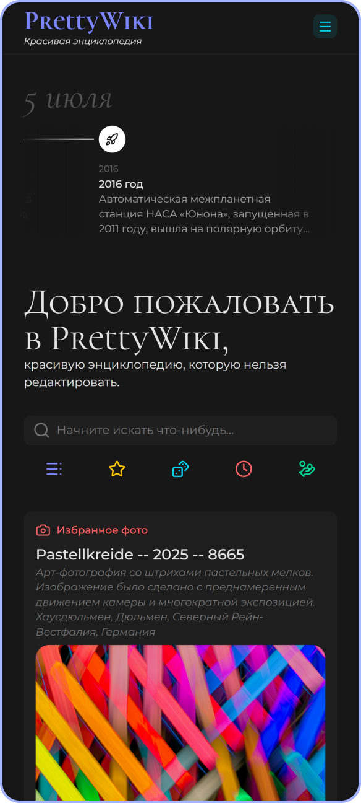

<div>
<br/>

<a href="https://prettywiki.vercel.app/">
  
</a>

<p>
  PrettyWiki is a Wikipedia client that aims to rethink its UI and give a fresh glance to a familiar reading experience.
</p>

<a href="https://prettywiki.vercel.app/">
  
</a>

<hr/>

<p>
  
  
  
  
  
  
  
</p>
</div>

## 🌀 About

**PrettyWiki** is a Vue project originally started as a learning exercise and continued as an independent experiment.  
The goal is simple: show that Wikipedia articles can be presented in a modern, visually clear, and reader-friendly interface.

This repository focuses on frontend implementation and UX polish around publicly available Wikipedia data.

## 🔧 How It Works

PrettyWiki uses a dedicated main page pipeline, separate from article rendering.  
This allows the landing experience to be optimized independently from content-heavy article pages.

For article navigation, the app keeps a small **LRU cache** in a **persistent Pinia store**.  
Recently viewed pages can be restored quickly, reducing repeated processing and improving perceived load time.

### 🧩 Parsing Pipeline

Article content goes through a normalization pipeline before rendering:

1. raw Wikipedia response (HTML) is fetched;
2. noisy/irrelevant fragments are filtered out;
3. content is split into typed UI blocks;
4. each block is rendered by a component matched to its block type.

This keeps rendering predictable and makes the article UI extensible as new block types are added.

Images are loaded progressively:  
thumbnails are shown first for faster initial paint, then replaced with higher-quality versions after full assets are available.

## 📷 Screenshots

<p>
  
  
  
  
</p>

## 🛠️ Stack

- [Vue](https://vuejs.org/) — core UI framework
- [TypeScript](https://www.typescriptlang.org/) — static typing for safer refactoring and clearer contracts
- [Vite](https://vitejs.dev/) — frontend build tool and dev server
- [Pinia](https://pinia.vuejs.org/) — state management, including a persistent LRU cache for recently viewed pages
- [Nuxt UI](https://ui.nuxt.com/) — reusable UI primitives and components
- [Tailwind CSS](https://tailwindcss.com/) — utility-first styling
- [Axios](https://axios-http.com/) — HTTP client for Wikipedia API requests
- [wtf_wikipedia](https://github.com/spencermountain/wtf_wikipedia) — parsing and restructuring article content into renderable UI blocks
- [Zod](https://zod.dev/) — runtime schema validation for external data
- [Wikipedia API](https://www.mediawiki.org/wiki/API:Main_page) — primary data source

## ⚡ Getting Started

### Prerequisites

- Node.js
- npm (or pnpm/yarn)

### Installation

```bash
git clone https://github.com/IciIcifur/prettywiki.git
cd prettywiki
npm install
```

### Development

```bash
npm run dev
```

### Production build

```bash
npm run build
npm run preview
```

## 🔗 Attribution and Credits

This project uses content from **Wikipedia** and related Wikimedia services via their public APIs.

- Wikipedia® is a registered trademark of the Wikimedia Foundation.
- Content is provided by Wikipedia contributors and is generally available under
  [CC BY-SA](https://creativecommons.org/licenses/by-sa/4.0/) (and may include other licenses where applicable).

Please refer to Wikimedia terms and licensing pages for full details:

- https://www.wikipedia.org/
- https://foundation.wikimedia.org/wiki/Policy:Terms_of_Use
- https://www.mediawiki.org/wiki/API:Main_page

## 📎 Disclaimer

PrettyWiki is an independent educational/pet project and is **not affiliated with or endorsed by** the Wikimedia Foundation.
